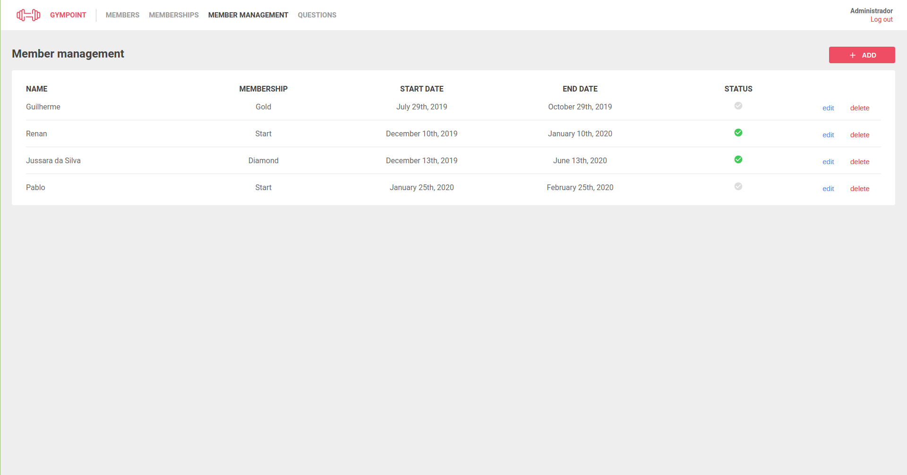
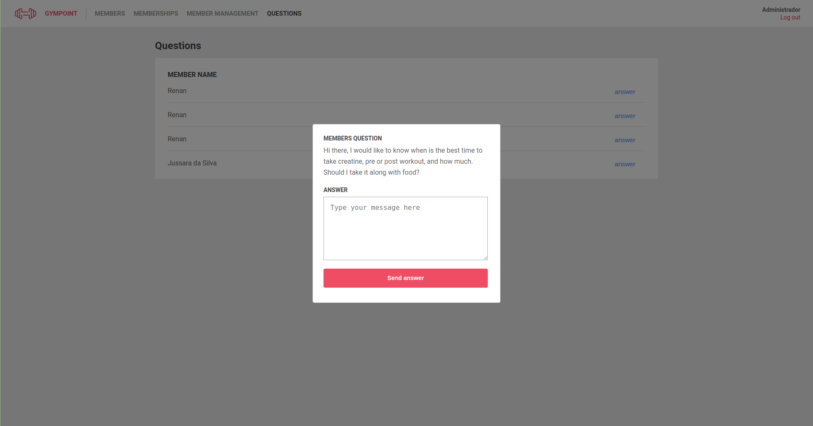

<h1 align="center">
  
</h1>

<h2 align="center"> <strong> Rocketseat GoStack final project. This is a gym management app with a web version for administrators and a mobile version (TODO) for gym members. Features: manage members, memberships, enrollments and questions.</strong></h2>

 [Instalation](#Instalation) [Running](#Running) [Author](#Author) [License](#License)

## Motivation

This project was developed to learn NodeJS, React and React Native as part of Rocketseat GoStack final project.

## Prerequisites

docker
Yarn
(todo)

## Instalation

TODO

## Running

##### `yarn dev`

Runs the server side app.

##### `yarn queue`

Runs the queue for mailing.

##### `yarn start`

Runs the web app.

Runs the app in the development mode. 
Open [http://localhost:3000](http://localhost:3000) to view it in the browser.

The page will reload if you make edits. 

## Author

Renan Marques - <rmavansi@gmail.com>

## License

The code in this project is licensed under MIT license.
