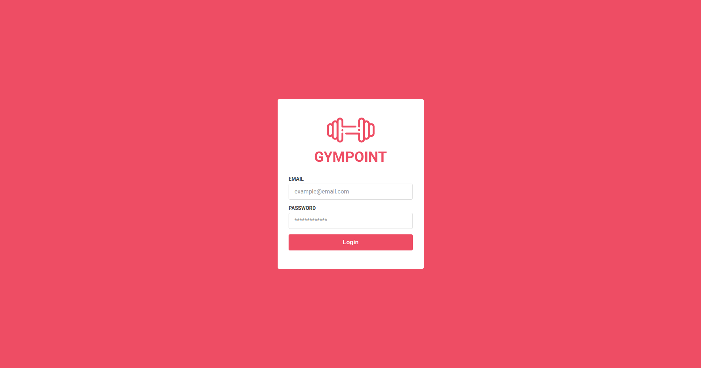
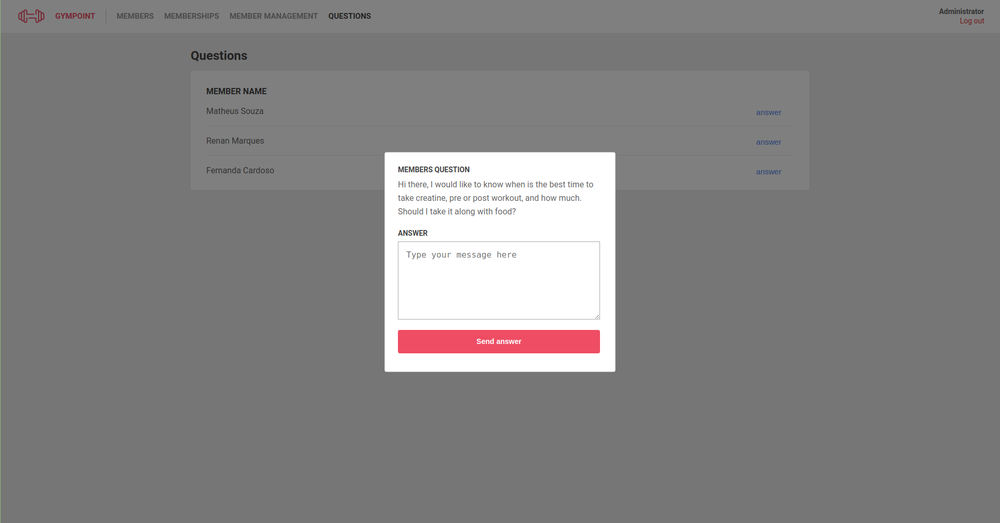
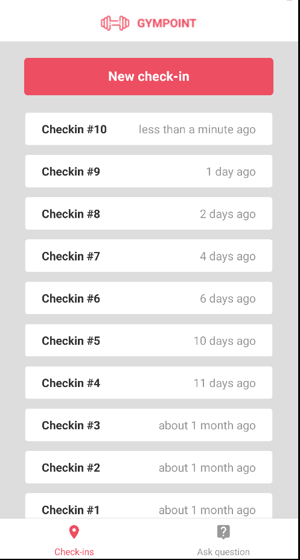
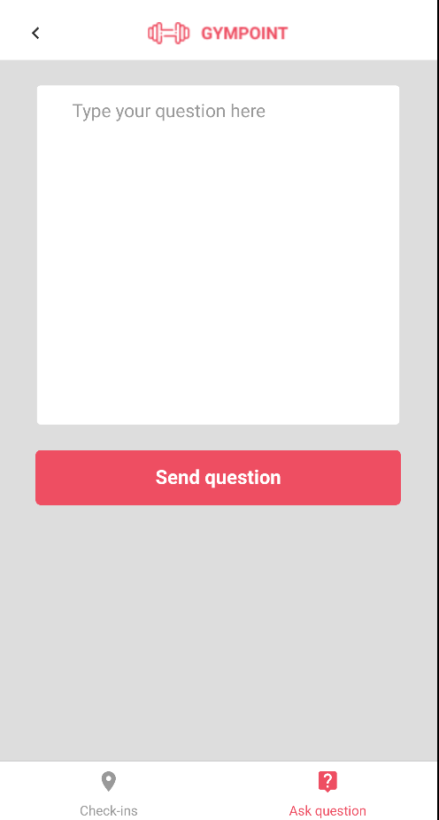

<h1 align="center">
  
</h1>

<h2 align="center"> <strong> Rocketseat GoStack 9.0 final project</strong></h2>

<p align="center">






</p>

## :bookmark_tabs: Table of contents

* <a href="#description">Description</a>
* <a href="#motivation">Motivation</a>
* <a href="#prerequisites">Prerequisites</a>
* <a href="#instalation">Instalation</a>
* <a href="#running">Running</a>
* <a href="#author">Author</a>
* <a href="#license">License</a>

## :blue_book: Description <a name="description"></a>

This project is a gym management application for gym management. This software has a backend, web version for administrators and a mobile version (android) for gym members.

Backend was developed with [NodeJS](https://nodejs.org/en/) and [Express](https://expressjs.com) to make a rest api server.

Web version was built with [React.JS](https://reactjs.org/) and its features are: manage members, memberships, enrollments and questions.

Mobile version was built with [React Native](https://facebook.github.io/react-native/) and <strong>tested only on android</strong>. Its features are: check-in tracker and send questions/read anwsers.

## :rocket: Motivation <a name="motivation"></a>

This project was developed to learn NodeJS, React and React Native as part of Rocketseat GoStack final project.

## :books: Prerequisites <a name="prerequisites"></a>

* [NodeJS](https://nodejs.org/en/) - JavaScript runtime environment;
* [Yarn](https://yarnpkg.com/lang/en/) or [npm](https://www.npmjs.com/) - Package Manager;
* [Docker](https://www.docker.com/) Containerization platform;
* [Docker-compose](https://docs.docker.com/compose/) Multi-container Docker applications;

## :anchor: Instalation <a name="instalation"></a>

```bash
git clone https://github.com/rmavansi/gympoint.git
docker-compose up
```

#### Server

```bash
# From the root folder
cd backend
yarn
yarn sequelize db:migrate
yarn sequelize db:seed:all
```

#### Frontend

```bash
# From the root folder
cd frontend
yarn
```

#### Mobile

```bash
# From the root folder
cd mobile
yarn
```

## :running: Running <a name="running"></a>

#### Server

```bash
# From the root folder
cd backend
yarn dev # Initializes server
yarn queue # Initializes email queue service
```

#### Frontend

```bash
# From the root folder
cd frontend
yarn start # Initializes web application
```

Open [http://localhost:3000](http://localhost:3000) to view it in the browser.</br>
The administrator's credentials are:

```bash
admin@gympoint.com
123456
```

#### Mobile

```bash
# From the root folder
cd mobile
yarn start # Runs the metro bundler
yarn android # Runs the mobile version
```

## :man: Author <a name="author"></a>

Renan Marques - <rmavansi@gmail.com>

## :memo: License <a name="license"></a>

The code in this project is licensed under MIT license. Read [LICENSE](LICENSE) for more details.
